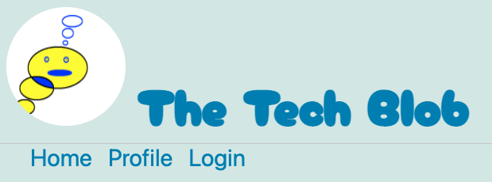
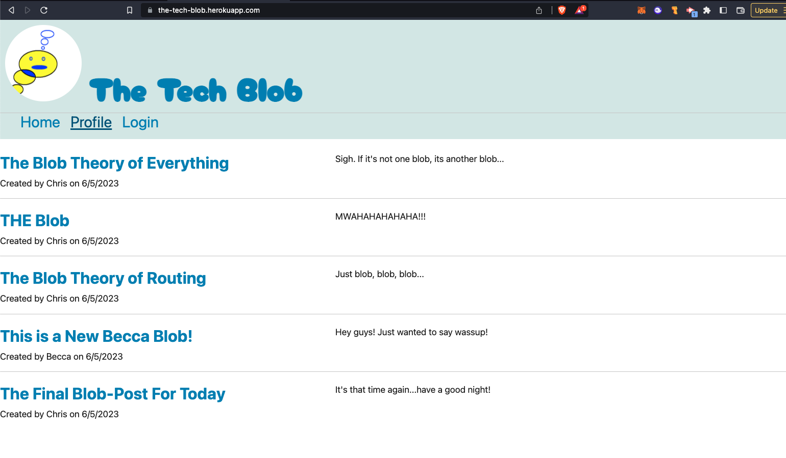
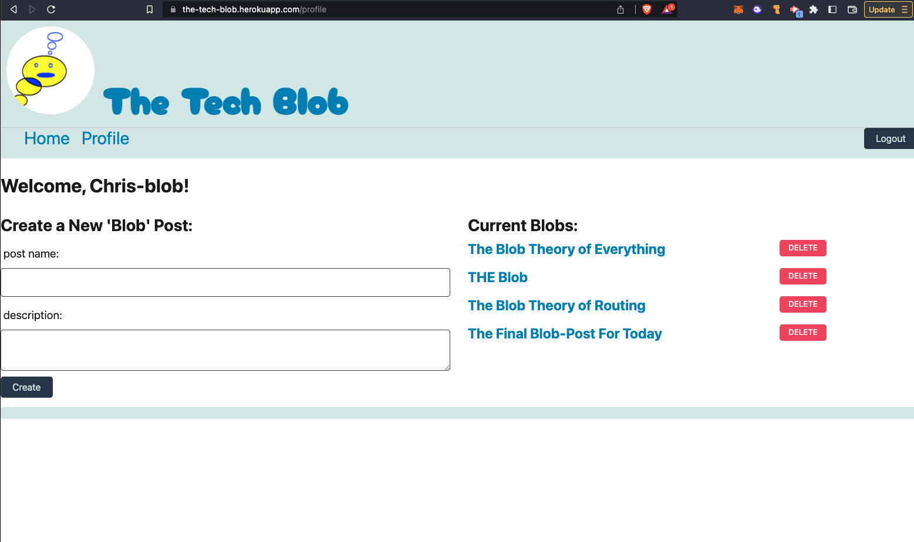
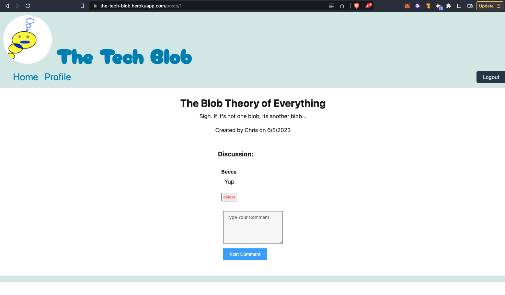

# The Tech Blob

A CMS-style blog site with a sense of humor.

## Description

- This blog site enables people with an interest in technology to share their ideas with others, comment on interesting topics and engage with a community using a Wordpress-style blog format.
- As a web developer, I want an easy to use forum for technology related posts and discussions as I continue to learn about the field of web development.
- Use this site to share your ideas and have a little fun while doing it.
- The developer learned about blog formating, full-stack application deployment on Heroku, and the importance of a well-structured database and security measures to protect user login information.

## Table Of Contents

- [Installation](#installation)

- [Usage](#usage)

- [Credits](#credits)

- [License](#license)

## Installation

This applicaiton is deployed on Heroku.

- just create a profile and login to begin using the platform!

If you want to run this from the command line:

- Clone the repo
- Initiate the database in mysql
  - Run "mysql" to login
  - Run "source schema.sql" to initate database
  - exit mysql
- Run "npm i"
- Run "npm start"
- Now available on http://localhost:3001/

## Usage

Create a profile, login, start blogging! Comment on other blog posts you find interesting!

## Screenshot / Video

[Link to Deployed Application on Heroku](https://the-tech-blob.herokuapp.com/)

## Contributing

Third party assets used in this project include:
google fonts: https://fonts.googleapis.com/css2?family=Cherry+Bomb+One&display=swap

Tutorials used in this project include:

## License

This project is licensed under the MIT license.

## Features

- User Login
- Secure Password using bcrypt
- Saves to SQL database
- MVC Format Full-Stack Application
- Save and Delete Comments and Posts
- Custom-Designed Logo and Style

## Questions

Please direct questions to the owner of this repository at ckc2007@gmail.com

Owner GitHub page:
[ckc2007](https://github.com/ckc2007).

## Credits

This README was created using the README generator app by ckc2007!
visit the GitHub page to try it out:
[README Generator app by ckc2007](https://github.com/ckc2007/README-Generator)
